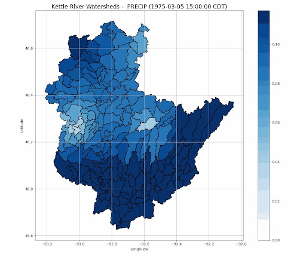
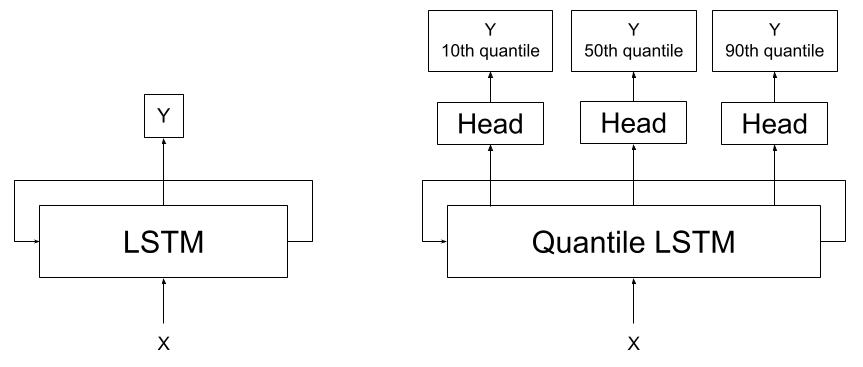

# Reports

The University of Minnesota team is developing machine learning (ML) models to predict streamflow in Minnesota watersheds based on historical and projected climate conditions. The workflow integrates climate model outputs, hydrologic simulation data, and watershed characteristics.

---

## Data Sources and Resolution

- **EDDEv1 Climate Data:** Hourly weather variables at ~36 km spatial resolution across the continental U.S.
- **HSPF Hydrologic Data:** Hourly streamflow simulations at the HUC8 watershed scale
- **Watershed Boundaries:** GIS shapefiles available at the HUC12 level

---

## Processing Pipeline

### 1. Weather Grid Selection
A K-Nearest Neighbors (KNN) algorithm selects climate data points relevant to each watershed.  
*Example:* The Kettle River watershed is represented by 9 nearby weather grid points.

### 2. Spatial Downscaling
To address the resolution gap between the climate data (~36 km) and HUC12 watershed boundaries, we apply **Inverse Distance Weighting (IDW)** to interpolate hourly weather data to each HUC12 sub-watershed, as illustrated in Figure 1.

  

*Figure 1. Kettle River watershed and nearby EDDEV1 grid points used for KNN-IDW interpolation.*

### 3. Aggregation to HUC8
Area-weighted averaging combines HUC12-level interpolated weather data into HUC8-scale summaries.

### 4. Hourly Time Series Generation
The aggregated climate data are merged with streamflow data to form complete hourly time series inputs for ML modeling.

---

All steps are automated in Python and can be reused to generate training datasets for any Minnesota watershed.

---

# LSTM vs. Quantile LSTM Models for Streamflow Prediction

The figure below illustrates two models—**LSTM** and **Quantile LSTM**—designed for streamflow prediction (**Y**) using weather drivers and watershed characteristics (**X**) as inputs.

  

*Figure 2. Architectures of standard LSTM and Quantile LSTM models for streamflow prediction.*

---

## 1. LSTM Model

In the **standard LSTM** model (left side of the figure), the LSTM network is trained in a **many-to-many** fashion, predicting a sequence of streamflow values over time:

$$
\hat{Y}_{1:t} = f_{\text{LSTM}}(X_{1:t})
$$

where:
- $X_{1:t}$ represents the input sequence of weather drivers and watershed characteristics up to time $t$,
- $f_{\text{LSTM}}$ is the LSTM model,
- $\hat{Y}_{1:t}$ is the predicted streamflow sequence.

This approach provides only a single deterministic estimate (often aligned with the mean or median) for each time step, which may not capture uncertainty or extreme events.

---

## 2. Quantile LSTM Model

The **Quantile LSTM** model (right side of the figure) extends the standard LSTM by predicting **multiple conditional quantiles** of the streamflow distribution for each time step. It uses multiple prediction heads, each corresponding to a specific quantile $q$:

$$
\hat{Y}_{1:t}^{(q)} = f_{\text{Quantile LSTM}}(X_{1:t}; q)
$$

where $q \in \{0.1, 0.5, 0.9\}$ in this case:
- $q = 0.1$: **10th quantile** – captures low-end events, useful for drought characterization.
- $q = 0.5$: **50th quantile (median)** – measures the central tendency, indicating general model performance.
- $q = 0.9$: **90th quantile** – captures high-end events, useful for flood prediction.

This many-to-many quantile prediction allows the model to capture uncertainty and variability in streamflow at each time step.

---

## 3. Quantile Regression

Quantile regression estimates the conditional quantile function $Q_Y(q \mid X)$ rather than the mean. It is trained using the **quantile loss function** (also known as the pinball loss):

$$
\mathcal{L}_q(Y, \hat{Y}) =
\begin{cases}
q (Y - \hat{Y}) & \text{if } Y \ge \hat{Y} \\
(q - 1)(Y - \hat{Y}) & \text{if } Y < \hat{Y}
\end{cases}
$$

Or equivalently:

$$
\mathcal{L}_q(Y, \hat{Y}) = (Y - \hat{Y}) \cdot (q - \mathbb{1}_{Y < \hat{Y}})
$$

where:
- $Y$ is the observed streamflow,
- $\hat{Y}$ is the predicted quantile,
- $q$ is the quantile level,
- $\mathbb{1}_{Y < \hat{Y}}$ is an indicator function.

The model minimizes the total loss across all quantile levels and time steps:

$$
\min_{\theta} \sum_{q} \sum_{t} \mathcal{L}_q \left( Y_t, \hat{Y}_t^{(q)} \right)
$$

---

## 4. Application for Droughts and Floods

- **Lower quantile (10th)**: Represents drought conditions and low-flow events.
- **Median quantile (50th)**: Measures typical conditions and overall model performance.
- **Higher quantile (90th)**: Represents extreme high-flow events, useful for flood modeling.

By predicting multiple quantiles for the entire sequence $\hat{Y}_{1:t}$, the Quantile LSTM can **characterize the entire distribution** of streamflow over time rather than producing only a single expected value.

