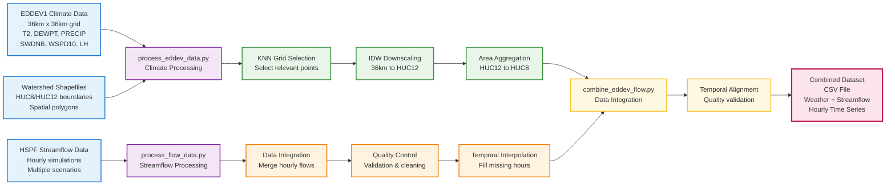

# Data Preprocessing Pipeline for Combined Dataset Generation



## Data Preprocessing Algorithm Details

### Climate Data Processing (process_eddev_data.py)

#### Step 1: K-Nearest Neighbors Grid Selection
- **Input**: 36km x 36km EDDEV1 climate grid, watershed polygons
- **Algorithm**: For each watershed, find the k nearest grid points
- **Purpose**: Reduce computational load by focusing on relevant grid cells
- **Output**: Subset of climate grid points per watershed

#### Step 2: Inverse Distance Weighting (IDW) Downscaling
- **Input**: Selected grid points, HUC12 sub-watershed boundaries
- **Algorithm**: 
  ```
  Value_HUC12 = Σ(Value_grid × Weight_distance) / Σ(Weight_distance)
  Weight = 1 / distance²
  ```
- **Purpose**: Downscale from 36km resolution to sub-watershed level
- **Output**: Weather variables interpolated to each HUC12

#### Step 3: Area-weighted Aggregation
- **Input**: HUC12-level weather data, HUC8 boundaries
- **Algorithm**:
  ```
  Value_HUC8 = Σ(Value_HUC12 × Area_HUC12) / Total_Area_HUC8
  ```
- **Purpose**: Aggregate sub-watersheds to main watershed scale
- **Output**: Basin-scale meteorological time series

### Streamflow Data Processing (process_flow_data.py)

#### Step 1: Multi-source Data Integration
- **Input**: HSPF hourly flows, daily metrics, scenario files
- **Algorithm**: Merge by datetime and scenario identifiers
- **Purpose**: Combine different temporal resolutions and data sources
- **Output**: Unified streamflow dataset

#### Step 2: Quality Control & Validation
- **Algorithm**: 
  - Detect missing values and gaps
  - Identify outliers using statistical thresholds
  - Flag inconsistent time stamps
- **Purpose**: Ensure data quality before processing
- **Output**: Quality-flagged streamflow data

#### Step 3: Temporal Interpolation
- **Algorithm**: Linear or spline interpolation for missing hours
- **Purpose**: Create continuous hourly time series
- **Output**: Gap-filled streamflow time series

### Final Data Integration (combine_eddev_flow.py)

#### Temporal Alignment
- **Algorithm**: Inner join on datetime index
- **Validation**: Check for temporal gaps and misalignments
- **Output**: Synchronized weather-streamflow dataset

#### Quality Assurance
- **Coverage Check**: Ensure adequate data coverage for modeling
- **Statistical Summary**: Generate descriptive statistics
- **Error Detection**: Flag potential data issues

## Final Combined Dataset Structure

| Column Type | Variables | Description |
|------------|-----------|-------------|
| **Climate** | T2, DEWPT, PRECIP, SWDNB, WSPD10, LH | Basin-averaged hourly meteorological data |
| **Streamflow** | Flow (various scenarios) | Hourly streamflow simulations |
| **Temporal** | DateTime index | Synchronized time stamps |
| **Metadata** | Scenario, Quality flags | Data provenance and quality indicators |

**Output File**: `KettleRiverModels_hist_scaled_combined.csv`
**Format**: Hourly time series ready for LSTM training
**Coverage**: Complete temporal coverage with quality validation
