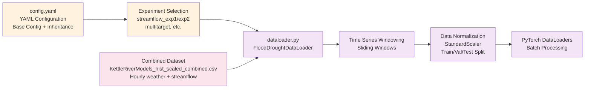

# DataLoader Pipeline for Machine Learning Training

## Detailed Workflow Description

### 1. Input Sources
- **Combined Dataset**: Preprocessed hourly time series data combining meteorological variables and streamflow targets (`KettleRiverModels_hist_scaled_combined.csv`)
- **Configuration System**: YAML-based configuration with inheritance and experiment-specific parameters (`config.yaml`)

### 2. Configuration Management

#### A. Base Configuration Loading (`config.yaml`)
1. **Parameter Definition**: Load base configuration parameters including data paths, model settings, and training hyperparameters
2. **Inheritance System**: Support for configuration inheritance allowing experiment-specific overrides
3. **Validation**: Verify configuration completeness and parameter validity
4. **Environment Setup**: Configure data directories, output paths, and logging settings

#### B. Experiment Selection
1. **Experiment Definition**: Select specific experiment configuration (e.g., `streamflow_exp1`, `streamflow_exp2`, `multitarget`)
2. **Parameter Override**: Apply experiment-specific parameter overrides to base configuration
3. **Target Selection**: Define prediction targets (single streamflow vs multi-target)
4. **Feature Configuration**: Specify input features and preprocessing requirements

### 3. Data Loading and Preprocessing Pipeline

#### A. DataLoader Initialization (`dataloader.py`)
1. **FloodDroughtDataLoader Class**: Initialize custom PyTorch dataset class for time series data
2. **Data Validation**: Verify dataset integrity, column presence, and data types
3. **Feature Engineering**: Extract and validate meteorological and streamflow features
4. **Memory Management**: Optimize data loading for large time series datasets

#### B. Time Series Windowing
1. **Sliding Window Creation**: Generate overlapping time windows for sequence-to-sequence learning
2. **Window Size Configuration**: Apply configurable lookback periods (e.g., 168 hours for weekly patterns)
3. **Target Alignment**: Ensure proper alignment between input sequences and prediction targets
4. **Temporal Validation**: Maintain chronological order and prevent data leakage

#### C. Data Normalization and Splitting
1. **Standardization**: Apply StandardScaler normalization to features and targets independently
2. **Scaler Fitting**: Fit normalization parameters on training data only to prevent data leakage
3. **Train/Validation/Test Split**: Create chronological splits preserving temporal relationships
4. **Split Validation**: Ensure balanced representation across different time periods and conditions

#### D. PyTorch DataLoader Creation
1. **Dataset Wrapping**: Convert processed arrays into PyTorch Dataset objects
2. **Batch Configuration**: Create DataLoader instances with appropriate batch sizes and shuffling
3. **Memory Optimization**: Configure efficient data loading with proper num_workers and pin_memory settings
4. **Validation Setup**: Prepare separate DataLoaders for training, validation, and testing phases

### 4. Output for Model Training

#### A. Training Pipeline Integration
- **Batch Generation**: Provide properly formatted batches for LSTM model training
- **Data Consistency**: Ensure consistent data format across training, validation, and test phases
- **Memory Efficiency**: Optimize memory usage for large-scale time series training

#### B. Model Training Support
- **Input Validation**: Verify batch dimensions and data types for model compatibility
- **Gradient Computation**: Support proper gradient flow during backpropagation
- **Evaluation Readiness**: Provide formatted data for model evaluation and inference
