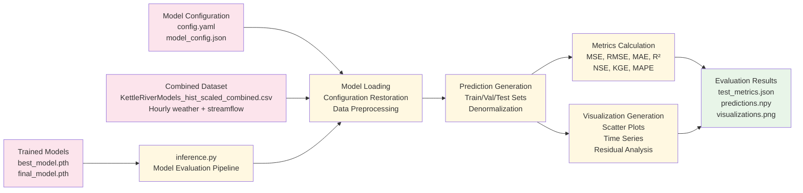

# Model Evaluation Pipeline

## Detailed Workflow Description

### 1. Input Sources
- **Trained Models**: Best and final model checkpoints saved during training (`best_model.pth`, `final_model.pth`)
- **Model Configuration**: Complete experiment configuration and model metadata (`config.yaml`, `model_config.json`)
- **Combined Dataset**: Original dataset for generating predictions on train/validation/test splits

### 2. Model Evaluation Pipeline

#### A. Evaluation Pipeline Initialization (`inference.py`)
1. **Configuration Loading**: Parse saved experiment parameters and model settings
2. **Model Selection**: Choose best or final model based on evaluation requirements
3. **Environment Setup**: Initialize evaluation environment with proper device settings
4. **Logging Setup**: Configure evaluation logging and output directories

#### B. Model Loading and Data Preparation
1. **Model Restoration**: Load trained LSTM model weights and architecture
2. **Configuration Restoration**: Restore exact training configuration and parameters
3. **Data Preprocessing**: Apply same preprocessing pipeline used during training
4. **Scaler Loading**: Restore normalization scalers for proper denormalization

#### C. Prediction Generation
1. **Dataset Processing**: Generate predictions for train, validation, and test sets
2. **Model Inference**: Run forward pass through trained LSTM without gradient computation
3. **Denormalization**: Convert normalized predictions back to original scale
4. **Output Formatting**: Structure predictions for analysis and visualization

#### D. Metrics Calculation
1. **Regression Metrics**: Calculate MSE, RMSE, MAE, and R² for prediction accuracy
2. **Hydrological Metrics**: Compute NSE (Nash-Sutcliffe Efficiency) and KGE (Kling-Gupta Efficiency)
3. **Error Metrics**: Calculate MAPE (Mean Absolute Percentage Error) and bias
4. **Statistical Analysis**: Generate comprehensive performance statistics

#### E. Visualization Generation
1. **Scatter Plots**: Observed vs predicted scatter plots with performance statistics
2. **Time Series Plots**: Temporal comparison of observed and predicted streamflow
3. **Residual Analysis**: Error distribution plots and residual time series
4. **Performance Visualization**: Loss curves and metric evolution plots

### 3. Final Evaluation Results

#### A. Quantitative Results
- **Metrics File**: Complete performance metrics saved as JSON (`test_metrics.json`)
- **Predictions Array**: Raw prediction outputs for further analysis (`predictions.npy`)
- **Performance Summary**: Tabulated results for all evaluation metrics

#### B. Visual Results
- **Visualization Files**: High-quality plots and charts (`visualizations.png`)
- **Interactive Plots**: HTML-based interactive visualizations for detailed analysis
- **Report Generation**: Automated evaluation reports with figures and statistics

#### C. Analysis Outputs
- **Model Performance**: Comprehensive assessment of prediction accuracy
- **Error Analysis**: Detailed examination of prediction errors and patterns
- **Comparative Analysis**: Performance comparison across different data splits
- **Validation Results**: Final model validation for deployment readiness
