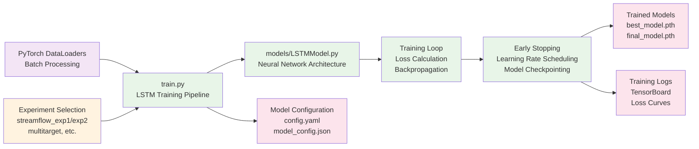

# Model Training Pipeline

## Detailed Workflow Description

### 1. Input Sources
- **Experiment Selection**: Configuration parameters from config.yaml for specific experiments (streamflow_exp1, streamflow_exp2, multitarget)
- **PyTorch DataLoaders**: Batch-processed training, validation, and test datasets ready for model consumption

### 2. Model Training Pipeline

#### A. Training Pipeline Initialization (`train.py`)
1. **Configuration Loading**: Parse experiment-specific parameters from config.yaml
2. **Model Instantiation**: Initialize LSTM model with specified architecture
3. **Optimizer Setup**: Configure Adam/SGD optimizer with learning rate scheduling
4. **Loss Function**: Setup appropriate loss functions (MSE, MAE, or custom quantile loss)

#### B. Neural Network Architecture (`models/LSTMModel.py`)
1. **LSTM Layers**: Configurable number of LSTM layers with hidden sizes
2. **Dropout Regularization**: Prevent overfitting with dropout layers
3. **Output Layers**: Linear layers for final predictions
4. **Activation Functions**: ReLU, Tanh, or other activation functions

#### C. Training Loop
1. **Forward Pass**: Process batched sequences through LSTM network
2. **Loss Calculation**: Compute prediction errors using specified loss function
3. **Backpropagation**: Calculate gradients and update model parameters
4. **Validation**: Evaluate model performance on validation set each epoch

#### D. Training Management
1. **Early Stopping**: Monitor validation loss to prevent overfitting
2. **Learning Rate Scheduling**: Adaptive learning rate adjustment
3. **Model Checkpointing**: Save best and final model states
4. **Progress Monitoring**: Track training metrics and convergence

### 3. Output Products

#### A. Trained Models
- **Best Model**: Model with lowest validation loss (`best_model.pth`)
- **Final Model**: Model state at training completion (`final_model.pth`)
- **Model Weights**: Complete neural network parameters and optimizer states

#### B. Training Logs
- **TensorBoard**: Interactive training visualization and metrics tracking
- **Loss Curves**: Training and validation loss progression over epochs
- **Performance Metrics**: RMSE, MAE, R², NSE, KGE tracking during training

#### C. Model Configuration
- **Saved Config**: Complete experiment configuration (`config.yaml`)
- **Model Metadata**: Architecture details and training parameters (`model_config.json`)
- **Reproducibility**: Seeds, versions, and environment information for replication
