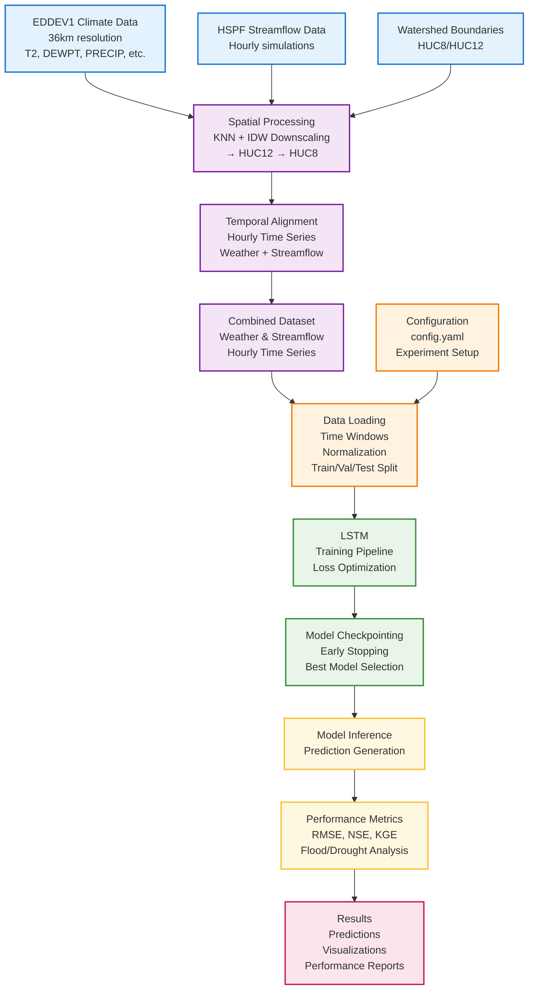

# Flood/Drought Prediction Workflow

<!-- ## Key Workflow Steps

### 1. **Data Integration**
- **Climate Data**: EDDEV1 meteorological variables at 36km resolution
- **Streamflow Data**: HSPF hourly simulation outputs
- **Spatial Processing**: KNN grid selection + IDW downscaling to watershed level

### 2. **Data Preparation**
- **Temporal Alignment**: Combine weather and streamflow into hourly time series
- **Windowing**: Create sequences for LSTM input
- **Normalization**: Standardize features for model training

### 3. **Model Development**
- **LSTM**: Sequential modeling for streamflow prediction
- **Multiple Quantiles**: Capture uncertainty and extreme events (floods/droughts)
- **Training Pipeline**: Optimization with early stopping and checkpointing

### 4. **Evaluation & Results**
- **Multi-quantile Predictions**: Generate uncertainty bounds
- **Performance Metrics**: RMSE, NSE, KGE for model validation
- **Extreme Event Analysis**: Flood and drought characterization

## Key Features
- **Spatial Downscaling**: From 36km climate grids to watershed-specific predictions
- **Uncertainty Quantification**: Multiple quantiles for risk assessment
- **Extreme Event Focus**: Specialized modeling for floods and droughts
- **Scalable Pipeline**: Configurable for multiple watersheds and scenarios -->
