# Flood/Drought Prediction Pipeline UML Flowchart

```mermaid
flowchart TD
    %% Data Sources
    A1[EDDEV1 Climate Data<br/>36km x 36km resolution<br/>T2, DEWPT, PRECIP, SWDNB, WSPD10, LH]
    A2[HSPF Streamflow Data<br/>Hourly simulations<br/>Multiple scenarios]
    A3[Watershed Shapefiles<br/>HUC8/HUC12 boundaries]
    
    %% Data Processing Pipeline
    B1[process_eddev_data.py<br/>Meteorological Processing]
    B2[process_flow_data.py<br/>Streamflow Processing]
    B3[combine_eddev_flow.py<br/>Data Integration]
    
    %% Processing Steps Detail
    C1[K-Nearest Neighbors<br/>Grid Point Selection]
    C2[Inverse Distance Weighting<br/>Spatial Downscaling<br/>HUC12 level]
    C3[Area-weighted Aggregation<br/>HUC8 level]
    C4[Temporal Alignment<br/>Hourly Time Series]
    
    %% Combined Dataset
    D1[Combined Dataset<br/>KettleRiverModels_hist_scaled_combined.csv<br/>Hourly weather + streamflow]
    
    %% Configuration
    E1[config.yaml<br/>YAML Configuration<br/>Base Config + Inheritance]
    E2[Experiment Selection<br/>streamflow_exp1/exp2<br/>multitarget, etc.]
    
    %% Data Loading and Preprocessing
    F1[dataloader.py<br/>FloodDroughtDataLoader]
    F2[Time Series Windowing<br/>Sliding Windows<br/>Many-to-many/Many-to-one]
    F3[Data Normalization<br/>StandardScaler<br/>Train/Val/Test Split]
    F4[PyTorch DataLoaders<br/>Batch Processing]
    
    %% Model Training
    G1[train.py<br/>LSTM Training Pipeline]
    G2[models/LSTMModel.py<br/>Neural Network Architecture]
    G3[Training Loop<br/>Loss Calculation<br/>Backpropagation]
    G4[Early Stopping<br/>Learning Rate Scheduling<br/>Model Checkpointing]
    
    %% Model Outputs
    H1[Trained Models<br/>best_model.pth<br/>final_model.pth]
    H2[Training Logs<br/>TensorBoard<br/>Loss Curves]
    H3[Model Configuration<br/>config.yaml<br/>model_config.json]
    
    %% Model Evaluation
    I1[inference.py<br/>Model Evaluation Pipeline]
    I2[Model Loading<br/>Configuration Restoration<br/>Data Preprocessing]
    I3[Prediction Generation<br/>Train/Val/Test Sets<br/>Denormalization]
    I4[Metrics Calculation<br/>MSE, RMSE, MAE, R²<br/>NSE, KGE, MAPE]
    I5[Visualization Generation<br/>Scatter Plots<br/>Time Series<br/>Residual Analysis]
    
    %% Final Results
    J1[Evaluation Results<br/>test_metrics.json<br/>predictions.npy<br/>visualizations.png]
    
    %% Flow connections
    A1 --> B1
    A2 --> B2
    A3 --> B1
    A3 --> B2
    
    B1 --> C1
    C1 --> C2
    C2 --> C3
    C3 --> C4
    B2 --> C4
    B1 --> B3
    B2 --> B3
    C4 --> B3
    
    B3 --> D1
    
    E1 --> E2
    E2 --> F1
    D1 --> F1
    
    F1 --> F2
    F2 --> F3
    F3 --> F4
    
    F4 --> G1
    E2 --> G1
    G1 --> G2
    G2 --> G3
    G3 --> G4
    
    G4 --> H1
    G4 --> H2
    G1 --> H3
    
    H1 --> I1
    H3 --> I2
    D1 --> I2
    I1 --> I2
    I2 --> I3
    I3 --> I4
    I3 --> I5
    
    I4 --> J1
    I5 --> J1
    
    %% Styling
    classDef dataSource fill:#e1f5fe
    classDef processing fill:#f3e5f5
    classDef config fill:#fff3e0
    classDef training fill:#e8f5e8
    classDef evaluation fill:#fff8e1
    classDef results fill:#fce4ec
    
    class A1,A2,A3 dataSource
    class B1,B2,B3,C1,C2,C3,C4,F1,F2,F3,F4 processing
    class E1,E2 config
    class G1,G2,G3,G4 training
    class I1,I2,I3,I4,I5 evaluation
    class D1,H1,H2,H3,J1 results
```

<!-- ## Detailed Workflow Description

### 1. Data Sources
- **EDDEV1 Climate Data**: 36km resolution meteorological variables (T2, DEWPT, PRECIP, SWDNB, WSPD10, LH)
- **HSPF Streamflow Data**: Hourly streamflow simulations for different climate scenarios
- **Watershed Shapefiles**: HUC8/HUC12 boundary definitions

### 2. Data Processing Pipeline

#### A. Meteorological Data Processing (`process_eddev_data.py`)
1. **K-Nearest Neighbors**: Select relevant weather grid points near watersheds
2. **Inverse Distance Weighting**: Downscale from 36km grid to HUC12 sub-watersheds  
3. **Area-weighted Aggregation**: Combine HUC12 data to HUC8 level
4. **Output**: Basin-specific meteorological time series

#### B. Streamflow Data Processing (`process_flow_data.py`)
1. **Data Integration**: Merge hourly flow with daily metrics
2. **Temporal Interpolation**: Fill missing hourly values
3. **Scenario Handling**: Process multiple climate scenarios
4. **Output**: Standardized streamflow time series

#### C. Data Integration (`combine_eddev_flow.py`)
1. **Temporal Alignment**: Match weather and flow data by datetime
2. **Quality Validation**: Check data consistency and coverage
3. **Output**: Combined hourly time series datasets

### 3. Machine Learning Pipeline

#### A. Configuration Management (`config.yaml`)
- YAML-based experiment configuration with inheritance
- Base configuration shared across experiments
- Experiment-specific overrides for different scenarios

#### B. Data Loading (`dataloader.py`)
1. **Time Series Windowing**: Create sliding windows for sequence modeling
2. **Data Normalization**: StandardScaler with proper train/test splitting
3. **PyTorch Integration**: Dataset and DataLoader creation
4. **Multi-target Support**: Handle multiple prediction variables

#### C. Model Training (`train.py`)
1. **LSTM Architecture**: Configurable layers, hidden sizes, dropout
2. **Training Loop**: Loss calculation, backpropagation, optimization
3. **Monitoring**: Early stopping, learning rate scheduling
4. **Logging**: TensorBoard integration, model checkpointing

#### D. Model Evaluation (`inference.py`)
1. **Model Loading**: Restore trained models and configurations
2. **Prediction Generation**: Process train/validation/test sets
3. **Metrics Calculation**: Comprehensive evaluation metrics
4. **Visualization**: Scatter plots, time series, residual analysis

### 4. Key Features
- **Spatial Processing**: KNN + IDW for meteorological downscaling
- **Temporal Modeling**: Many-to-many LSTM sequence prediction
- **Multi-scenario Support**: Historical, RCP4.5, RCP8.5 climate scenarios
- **Reproducibility**: YAML configuration with seed management
- **Scalability**: Batch processing for multiple watersheds
- **Visualization**: Comprehensive analysis and plotting tools

### 5. Output Products
- **Trained Models**: Best and final model checkpoints
- **Evaluation Metrics**: Quantitative performance measures
- **Visualizations**: Time series plots, scatter plots, residual analysis
- **Predictions**: Raw model outputs for further analysis -->
